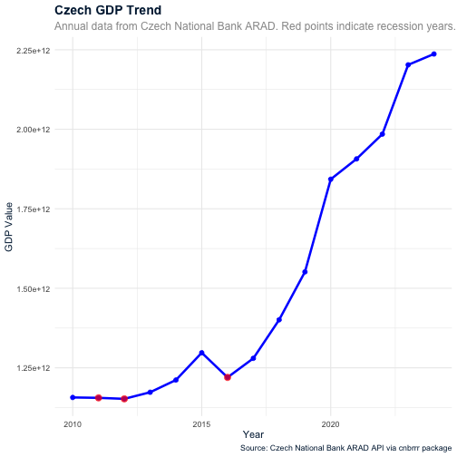
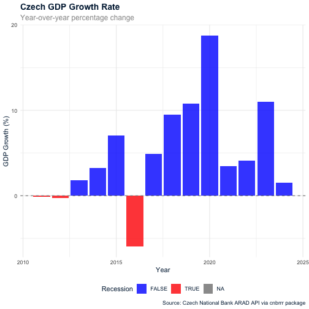

The `cnbrrr` package provides a convenient interface to the Czech National Bank's ARAD (Aggregated data of the CNB) API for accessing economic and financial data.

## Installation

Install the development version from GitHub:


``` r
# install.packages("remotes")
remotes::install_github("petrbouchal/cnbrrr")
```

## Setup

Before using the package, obtain an API key from the Czech National Bank.
This is free and automatic but requires registration at the [ARAD website](https://www.cnb.cz/arad/).

Set it as an environment variable:


``` r
# Set your API key
Sys.setenv(ARAD_API_KEY = "your_api_key_here")
```

Ideally set it in your `.Renviron` file for persistence and security:

```r
usethis::edit_r_environ()
```

then add (don't forget newline at end of file, and to restart R):

```
ARAD_API_KEY=your_api_key_here
```

Alternatively, you can pass the API key directly to function calls.

## Core workflow

### 1. Discover available data

Start by exploring what indicators are available. The ARAD API provides several endpoints for discovering indicators:


``` r
library(cnbrrr)

# Get indicators from a specific data set (replace with actual set_id)
indicators <- arad_list_indicators(set_id = 1115, filter = "podnik")
head(indicators)
#> # A tibble: 1 × 7
#>   indicator_id indicator_name           frequency_code frequency_name unit_mult_code
#>   <chr>        <chr>                    <chr>          <chr>          <chr>         
#> 1 SRDM02712C   Inkasa celostátních daň… M              Měsíční        6             
#> # ℹ 2 more variables: unit_mult_name <chr>, unit <chr>
```


``` r
# Filter indicators by name within a data set
gdp_indicators <- arad_list_indicators(set_id = 1032, filter = "Místní vládní instituce")
gdp_indicators
#> # A tibble: 78 × 7
#>    indicator_id    indicator_name       frequency_code frequency_name unit_mult_code
#>    <chr>           <chr>                <chr>          <chr>          <chr>         
#>  1 SFU0QS1313L01LE Finanční účty, Akti… Q              Čtvrtletní     6             
#>  2 SFU0QS1313L01T  Finanční účty, Akti… Q              Čtvrtletní     6             
#>  3 SFU0QS1313A01LE Finanční účty, Akti… Q              Čtvrtletní     6             
#>  4 SFU0QS1313A01T  Finanční účty, Akti… Q              Čtvrtletní     6             
#>  5 SFU2QS1313L05T  Finanční účty, F2 O… Q              Čtvrtletní     6             
#>  6 SFU2QS1313A05LE Finanční účty, F2 O… Q              Čtvrtletní     6             
#>  7 SFU2QS1313A05T  Finanční účty, F2 O… Q              Čtvrtletní     6             
#>  8 SFU2QS1313A06LE Finanční účty, F2 O… Q              Čtvrtletní     6             
#>  9 SFU2QS1313A06T  Finanční účty, F2 O… Q              Čtvrtletní     6             
#> 10 SFU2QS1313L07T  Finanční účty, F2 O… Q              Čtvrtletní     6             
#> # ℹ 68 more rows
#> # ℹ 2 more variables: unit_mult_name <chr>, unit <chr>
```


``` r
# Get specific indicators by indicator IDs
specific_indicators <- arad_list_indicators(indicator_id_list = "SFU2QS1313L05T")
specific_indicators
#> # A tibble: 1 × 7
#>   indicator_id   indicator_name         frequency_code frequency_name unit_mult_code
#>   <chr>          <chr>                  <chr>          <chr>          <chr>         
#> 1 SFU2QS1313L05T Finanční účty, F2 Obě… Q              Čtvrtletní     6             
#> # ℹ 2 more variables: unit_mult_name <chr>, unit <chr>
```


``` r
# Get multiple indicators by their IDs
multiple_indicators <- arad_list_indicators(indicator_id_list = c("SFU2QS1313L05T", "SFU2QS1313A06LE"))
multiple_indicators
#> # A tibble: 2 × 7
#>   indicator_id    indicator_name        frequency_code frequency_name unit_mult_code
#>   <chr>           <chr>                 <chr>          <chr>          <chr>         
#> 1 SFU2QS1313L05T  Finanční účty, F2 Ob… Q              Čtvrtletní     6             
#> 2 SFU2QS1313A06LE Finanční účty, F2 Ob… Q              Čtvrtletní     6             
#> # ℹ 2 more variables: unit_mult_name <chr>, unit <chr>
```


``` r
# Get indicators from a named selection in your ARAD account
selection_indicators <- arad_list_indicators(selection_id = "my_selection")
selection_indicators
```

Explore the structure and organization of indicators:


``` r
# Get indicator dimensions (shows how indicators are organized)
indicators_in_base <- arad_list_indicators(base_id = "MBOP")
head(indicators_in_base)
#> # A tibble: 6 × 7
#>   indicator_id  indicator_name          frequency_code frequency_name unit_mult_code
#>   <chr>         <chr>                   <chr>          <chr>          <chr>         
#> 1 MBOPCAHDPPECY Platební bilance:Běžný… Y              Roční          0             
#> 2 MBOPCCHDPPECY Platební bilance:Běžný… Y              Roční          0             
#> 3 MBOPDICZXVOLY Platební bilance:Přímé… Y              Roční          9             
#> 4 MBOPLPIXXVOLY Platební bilance:Pasiv… Y              Roční          9             
#> 5 MBOPADSXXVOLY Platební bilance:Aktiv… Y              Roční          9             
#> 6 MBOPAPIXXVOLY Platební bilance:Aktiv… Y              Roční          9             
#> # ℹ 2 more variables: unit_mult_name <chr>, unit <chr>
```


``` r
# Get dimensional structure for a specific set
dims <- arad_indicators_dims(set_id = 1115)
head(dims)
#> # A tibble: 6 × 8
#>   indicator_id base_code base_name   dim_code dim_name dim_value_code dim_value_name
#>   <chr>        <chr>     <chr>       <chr>    <chr>    <chr>          <chr>         
#> 1 SRDM01202C   SRD       Inkasa cel… FREKVEN… Frekven… M              Měsíční       
#> 2 SRDM01202C   SRD       Inkasa cel… STO      Položka… 012            Daň z přidané…
#> 3 SRDM01202C   SRD       Inkasa cel… COUNTER… Sektor … 02             Ekonomika cel…
#> 4 SRDM01202C   SRD       Inkasa cel… CUMMUL   Kumulace C              Hodnoty kumul…
#> 5 SRDM01302C   SRD       Inkasa cel… FREKVEN… Frekven… M              Měsíční       
#> 6 SRDM01302C   SRD       Inkasa cel… STO      Položka… 013            Clo           
#> # ℹ 1 more variable: dim_rank <chr>
```


``` r
# Get dimensions for specific indicators
specific_dims <- arad_indicators_dims(indicator_id_list = c("SFU2QS1313L05T", "SFU2QS1313A06LE"))
specific_dims
#> # A tibble: 10 × 8
#>    indicator_id  base_code base_name dim_code dim_name dim_value_code dim_value_name
#>    <chr>         <chr>     <chr>     <chr>    <chr>    <chr>          <chr>         
#>  1 SFU2QS1313A0… SFU2      Finanční… FREKVEN… Frekven… Q              "Čtvrtletní"  
#>  2 SFU2QS1313A0… SFU2      Finanční… SEKTOR_… Sektory… S1313          "Místní vládn…
#>  3 SFU2QS1313A0… SFU2      Finanční… BALANCE  Balance  A              "Aktiva"      
#>  4 SFU2QS1313A0… SFU2      Finanční… FIN_UCT  Finančn… 06             "Oběživo "    
#>  5 SFU2QS1313A0… SFU2      Finanční… ST       Stavy/t… LE             "Stavy"       
#>  6 SFU2QS1313L0… SFU2      Finanční… FREKVEN… Frekven… Q              "Čtvrtletní"  
#>  7 SFU2QS1313L0… SFU2      Finanční… SEKTOR_… Sektory… S1313          "Místní vládn…
#>  8 SFU2QS1313L0… SFU2      Finanční… BALANCE  Balance  L              "Pasiva"      
#>  9 SFU2QS1313L0… SFU2      Finanční… FIN_UCT  Finančn… 05             "Oběživo a vk…
#> 10 SFU2QS1313L0… SFU2      Finanční… ST       Stavy/t… T              "Transakce"   
#> # ℹ 1 more variable: dim_rank <chr>
```


``` r
# Get dimensions from a named selection
selection_dims <- arad_indicators_dims(selection_id = "my_selection")
selection_dims
```


``` r
# Get the hierarchical tree structure of indicators
tree <- arad_indicators_tree(set_id = 1115)
head(tree)
#> # A tibble: 6 × 2
#>   indicator_id path                                   
#>   <chr>        <chr>                                  
#> 1 SRDM01202C   Statistická data/Státní rozpočet a daně
#> 2 SRDM01302C   Statistická data/Státní rozpočet a daně
#> 3 SRDM01402C   Statistická data/Státní rozpočet a daně
#> 4 SRDM01502C   Statistická data/Státní rozpočet a daně
#> 5 SRDM01602C   Statistická data/Státní rozpočet a daně
#> 6 SRDM02613C   Statistická data/Státní rozpočet a daně
```


``` r
# Get tree structure for specific indicators
specific_tree <- arad_indicators_tree(indicator_id_list = c("SFU2QS1313L05T", "SFU2QS1313A06LE"))
specific_tree
#> # A tibble: 2 × 2
#>   indicator_id    path                                                     
#>   <chr>           <chr>                                                    
#> 1 SFU2QS1313A06LE Statistická data/Statistika finančních účtů/Finanční účty
#> 2 SFU2QS1313L05T  Statistická data/Statistika finančních účtů/Finanční účty
```


``` r
# Get tree structure from a named selection
selection_tree <- arad_indicators_tree(selection_id = "my_selection")
selection_tree
```

**Finding IDs**: To effectively use these functions, browse the [ARAD web interface](https://www.cnb.cz/arad/) to find:
- **set_id**: Identifies data sets (collections of related indicators)
- **base_id**: Identifies specific indicators within sets
- **indicators_list**: Use specific indicator IDs when you know exactly which indicators you need (e.g., "SRUMD08402")
- **selection_id**: Use named selections you've created in your ARAD user account to group indicators

### 2. Retrieve data for specific indicators

Get time series data for the indicators you need:


``` r
# Get data for a single indicator
data <- arad_get_data(c("MBOPCAHDPPECY", "MBOPCCHDPPECY"))
#> File already exists at /var/folders/fr/6f85xds52pq7g55fpmk4z7f80000gn/T//RtmpIyo23f/arad_MBOPCAHDPPECY_MBOPCCHDPPECY.csv. Loading from cache. Use force_redownload = TRUE to redownload.
data
#> # A tibble: 66 × 6
#>    indicator_id  snapshot_id period              value  year month
#>    <chr>         <chr>       <dttm>              <dbl> <dbl> <dbl>
#>  1 MBOPCAHDPPECY 77          2027-12-31 00:00:00   1.3  2027    12
#>  2 MBOPCAHDPPECY 77          2026-12-31 00:00:00   1.1  2026    12
#>  3 MBOPCAHDPPECY 77          2025-12-31 00:00:00   1.5  2025    12
#>  4 MBOPCAHDPPECY 77          2024-12-31 00:00:00   1.7  2024    12
#>  5 MBOPCAHDPPECY 77          2023-12-31 00:00:00  -0.1  2023    12
#>  6 MBOPCAHDPPECY 77          2022-12-31 00:00:00  -4.7  2022    12
#>  7 MBOPCAHDPPECY 77          2021-12-31 00:00:00  -2.1  2021    12
#>  8 MBOPCAHDPPECY 77          2020-12-31 00:00:00   1.8  2020    12
#>  9 MBOPCAHDPPECY 77          2019-12-31 00:00:00   0.3  2019    12
#> 10 MBOPCAHDPPECY 77          2018-12-31 00:00:00   0.4  2018    12
#> # ℹ 56 more rows
```


``` r
# Get data for multiple indicators at once
multi_data <- arad_get_data(indicator_ids = c("MBOPCAHDPPECY", "MBOPCCHDPPECY"),
                            period_to = "20231231",
                            period_from = "20201031")
#> File already exists at /var/folders/fr/6f85xds52pq7g55fpmk4z7f80000gn/T//RtmpIyo23f/arad_MBOPCAHDPPECY_MBOPCCHDPPECY_20201031_20231231.csv. Loading from cache. Use force_redownload = TRUE to redownload.
multi_data
#> # A tibble: 8 × 6
#>   indicator_id  snapshot_id period              value  year month
#>   <chr>         <chr>       <dttm>              <dbl> <dbl> <dbl>
#> 1 MBOPCAHDPPECY 77          2023-12-31 00:00:00  -0.1  2023    12
#> 2 MBOPCAHDPPECY 77          2022-12-31 00:00:00  -4.7  2022    12
#> 3 MBOPCAHDPPECY 77          2021-12-31 00:00:00  -2.1  2021    12
#> 4 MBOPCAHDPPECY 77          2020-12-31 00:00:00   1.8  2020    12
#> 5 MBOPCCHDPPECY 77          2023-12-31 00:00:00   1    2023    12
#> 6 MBOPCCHDPPECY 77          2022-12-31 00:00:00  -4.1  2022    12
#> 7 MBOPCCHDPPECY 77          2021-12-31 00:00:00  -0.4  2021    12
#> 8 MBOPCCHDPPECY 77          2020-12-31 00:00:00   2.9  2020    12
```


``` r
# Get raw data without processing (returns raw CSV data)
raw_data <- arad_get_data("SRUMD08402C", process_data = FALSE)
#> File already exists at /var/folders/fr/6f85xds52pq7g55fpmk4z7f80000gn/T//RtmpIyo23f/arad_SRUMD08402C.csv. Loading from cache. Use force_redownload = TRUE to redownload.
```


``` r
# Get data with both filters and rename the value column
spending <- arad_get_data("SRUMD08402C",
                           period_from = "20121231",
                           period_to = "20241231",
                           rename_value = "government_spending")
#> File already exists at /var/folders/fr/6f85xds52pq7g55fpmk4z7f80000gn/T//RtmpIyo23f/arad_SRUMD08402C_20121231_20241231.csv. Loading from cache. Use force_redownload = TRUE to redownload.
spending
#> # A tibble: 145 × 6
#>    indicator_id snapshot_id period              government_spending  year month
#>    <chr>        <chr>       <dttm>                            <dbl> <dbl> <dbl>
#>  1 SRUMD08402C  <NA>        2024-12-31 00:00:00             2.24e12  2024    12
#>  2 SRUMD08402C  <NA>        2024-11-30 00:00:00             2.00e12  2024    11
#>  3 SRUMD08402C  <NA>        2024-10-31 00:00:00             1.80e12  2024    10
#>  4 SRUMD08402C  <NA>        2024-09-30 00:00:00             1.63e12  2024     9
#>  5 SRUMD08402C  <NA>        2024-08-31 00:00:00             1.45e12  2024     8
#>  6 SRUMD08402C  <NA>        2024-07-31 00:00:00             1.30e12  2024     7
#>  7 SRUMD08402C  <NA>        2024-06-30 00:00:00             1.13e12  2024     6
#>  8 SRUMD08402C  <NA>        2024-05-31 00:00:00             9.32e11  2024     5
#>  9 SRUMD08402C  <NA>        2024-04-30 00:00:00             7.45e11  2024     4
#> 10 SRUMD08402C  <NA>        2024-03-31 00:00:00             5.54e11  2024     3
#> # ℹ 135 more rows
```

## Working with indicator structure

You can explore how indicators are organized using the dimension and tree functions covered in the discovery section above. These provide insights into the hierarchical structure and dimensional organization of the ARAD data.

## Utility functions

The package includes several helper functions:


``` r
# Validate indicator ID format
valid_ids <- arad_validate_indicators(c("SRUMD08402C", "INVALID_ID"))
valid_ids
#> [1]  TRUE FALSE
```


``` r
# Parse ARAD date format manually
dates <- arad_parse_date(c("20231201", "20231101"))
dates
#> [1] "2023-12-01 UTC" "2023-11-01 UTC"
```

## Complete analysis example

Here's a full workflow for analyzing Czech economic data:


``` r
library(cnbrrr)
library(dplyr)
library(ggplot2)

# 1. Find relevant indicators
indicators <- arad_list_indicators(base_id = "SHDPZDR", filter = "HDP")
print(head(indicators))
#> # A tibble: 6 × 7
#>   indicator_id      indicator_name      frequency_code frequency_name unit_mult_code
#>   <chr>             <chr>               <chr>          <chr>          <chr>         
#> 1 SHDPZDRQ1B1GIPSA  Zdroje HDP:Čtvrtle… Q              Čtvrtletní     0             
#> 2 SHDPZDRQ1B1GMIPSA Zdroje HDP:Čtvrtle… Q              Čtvrtletní     0             
#> 3 SHDPZDRQ1B1GISNA  Zdroje HDP:Čtvrtle… Q              Čtvrtletní     0             
#> 4 SHDPZDRQ1D31ISNA  Zdroje HDP:Čtvrtle… Q              Čtvrtletní     0             
#> 5 SHDPZDRQ1B1GMISNA Zdroje HDP:Čtvrtle… Q              Čtvrtletní     0             
#> 6 SHDPZDRQ1B1GMLSA  Zdroje HDP:Čtvrtle… Q              Čtvrtletní     6             
#> # ℹ 2 more variables: unit_mult_name <chr>, unit <chr>
```


``` r
# 2. Get the data (assuming we found a GDP indicator)
gdp_data <- arad_get_data("SRUMD08402C",
                           rename_value = "gdp") |>
  filter(lubridate::month(period) == 12)
#> File already exists at /var/folders/fr/6f85xds52pq7g55fpmk4z7f80000gn/T//RtmpIyo23f/arad_SRUMD08402C.csv. Loading from cache. Use force_redownload = TRUE to redownload.

# 3. Process and analyze
recent_gdp <- gdp_data  |>
  filter(year >= 2010) |>
  arrange(year) |>
  mutate(
    gdp_growth = (gdp / lag(gdp) - 1) * 100,
    is_recession = gdp_growth < 0
  )

# 4. Summary statistics
gdp_summary <- recent_gdp |>
  summarise(
    mean_gdp = mean(gdp, na.rm = TRUE),
    mean_growth = mean(gdp_growth, na.rm = TRUE),
    latest_year = max(year, na.rm = TRUE),
    latest_gdp = gdp[year == latest_year][1],
    recession_years = sum(is_recession, na.rm = TRUE)
  )

print(gdp_summary)
#> # A tibble: 1 × 5
#>   mean_gdp mean_growth latest_year latest_gdp recession_years
#>      <dbl>       <dbl>       <dbl>      <dbl>           <int>
#> 1  1.52e12        4.99        2024    2.24e12               3
```


``` r
# 5. Create visualization
gdp_plot <- ggplot(recent_gdp, aes(x = year, y = gdp)) +
  geom_line(color = "#0000ff", size = 1.2) +
  geom_point(color = "#0000ff", size = 2) +
  geom_point(data = filter(recent_gdp, is_recession),
             color = "red", size = 3, alpha = 0.7) +
  labs(
    title = "Czech GDP Trend",
    subtitle = "Annual data from Czech National Bank ARAD. Red points indicate recession years.",
    x = "Year",
    y = "GDP Value",
    caption = "Source: Czech National Bank ARAD API via cnbrrr package"
  ) +
  theme_minimal() +
  theme(
    plot.title = element_text(size = 14, face = "bold", color = "#001F3F"),
    plot.subtitle = element_text(size = 12, color = "gray60"),
    text = element_text(color = "#001F3F")
  )

print(gdp_plot)
```

<div class="figure">

<p class="caption">plot of chunk unnamed-chunk-24</p>
</div>


``` r
# 6. Growth rate visualization
growth_plot <- ggplot(recent_gdp, aes(x = year, y = gdp_growth)) +
  geom_col(aes(fill = is_recession), alpha = 0.8) +
  geom_hline(yintercept = 0, linetype = "dashed", color = "gray50") +
  scale_fill_manual(values = c("FALSE" = "#0000ff", "TRUE" = "red")) +
  labs(
    title = "Czech GDP Growth Rate",
    subtitle = "Year-over-year percentage change",
    x = "Year",
    y = "GDP Growth (%)",
    fill = "Recession",
    caption = "Source: Czech National Bank ARAD API via cnbrrr package"
  ) +
  theme_minimal() +
  theme(
    plot.title = element_text(size = 14, face = "bold", color = "#001F3F"),
    plot.subtitle = element_text(size = 12, color = "gray60"),
    text = element_text(color = "#001F3F"),
    legend.position = "bottom"
  )

print(growth_plot)
#> Warning: Removed 1 row containing missing values or values outside the scale range
#> (`geom_col()`).
```

<div class="figure">

<p class="caption">plot of chunk unnamed-chunk-25</p>
</div>

## Data format and structure

All functions return data frames with consistent column structure:

- **`period`**: Date object (converted from YYYYMMDD format)
- **`value`**: Numeric data values
- **`year`**: Extracted year from period
- **`month`**: Extracted month from period
- **`quarter`**: Extracted quarter from period (when applicable)

Additional columns may be present depending on the specific data series.


``` r
# Example of typical data structure
sample_data <- arad_get_data("SRUMD08402C")
#> File already exists at /var/folders/fr/6f85xds52pq7g55fpmk4z7f80000gn/T//RtmpIyo23f/arad_SRUMD08402C.csv. Loading from cache. Use force_redownload = TRUE to redownload.
str(sample_data)
#> tibble [392 × 6] (S3: tbl_df/tbl/data.frame)
#>  $ indicator_id: chr [1:392] "SRUMD08402C" "SRUMD08402C" "SRUMD08402C" "SRUMD08402C" ...
#>  $ snapshot_id : chr [1:392] NA NA NA NA ...
#>  $ period      : POSIXct[1:392], format: "2025-08-31" "2025-07-31" ...
#>  $ value       : num [1:392] 1.50e+12 1.34e+12 1.16e+12 9.45e+11 7.49e+11 ...
#>  $ year        : num [1:392] 2025 2025 2025 2025 2025 ...
#>  $ month       : num [1:392] 8 7 6 5 4 3 2 1 12 11 ...
```

## API endpoints used

The package accesses these ARAD API endpoints:

- **`/aradb/api/v1/data`** - Time series data retrieval
- **`/aradb/api/v1/indicators`** - Available indicators listing
- **`/aradb/api/v1/indicators-dims`** - Indicator dimensional structure
- **`/aradb/api/v1/indicators-tree`** - Hierarchical indicator tree structure

## Next steps

- Explore the [function reference](../reference/index.html) for detailed documentation
- Check out additional examples in the [articles](../articles/index.html) section
- Visit the [Czech National Bank ARAD website](https://www.cnb.cz/arad/) for more information about available data series
- Report issues or contribute at the [GitHub repository](https://github.com/petrbouchal/cnbrrr)
